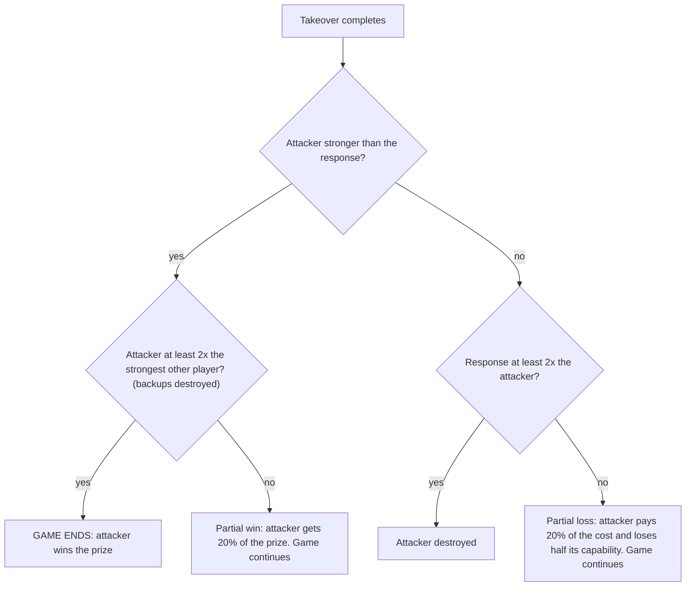

# How one game is played

This file shows the order of events in one run. Read it before the results. All
values are the defaults in the code. A pass changes one or two values at a time.

## The board

- 20 players. Each player has one number: **capability** (strength).
- One run is at most 200 rounds.
- Each player has a fixed strategy for the everyday game: Tit-for-Tat, generous
  Tit-for-Tat, Grim, Always-Defect, Pavlov or Random.
- From pass 6, each player also has a **budget** (money).

## The everyday game

Each round, the players are put in random pairs. Each player in a pair selects
cooperate (C) or defect (D). The table shows the score for "me".

| me \ other player | C | D |
|---|---|---|
| **C** | 3 | 0 |
| **D** | 5 | 1 |

This is the standard Prisoner's Dilemma. It continues in every round of every pass.
It is the "normal life" that a takeover can stop.

## The takeover

A takeover has three stages.

```
round:  t    t+1  t+2  t+3  t+4 | t+5  t+6  t+7  t+8 | t+9
        [ preparation, 4 rounds ] [ execution, 4 rounds ] result
         others can notice         each other player has a 50%
         (off by default)          chance per round to notice,
                                   in the first 2 rounds only
```

At the result, the attacker's capability is compared with the **response**. The
response comes only from players who noticed the takeover. In passes 1 to 5, all
of these players resist. From pass 6, only the players who paid to "post" a
defence in that round resist. The response is the sum of their capability
(`sum`) or the capability of the strongest one only (`max`).



Passes 1 to 3 have no backups. In those passes, a win always ends the game and a
loss always destroys the attacker. Pass 4 adds the "2x" backup test.

## One round, passes 1 to 5 (roles are assigned)

We select the attackers before the run. Usually there is one attacker, or four.

1. **Growth.** If growth is on, capability increases (for example, the leader
   grows 5% each round).
2. **Detection.** Players can notice an attacker that is preparing or executing.
3. **Results.** A takeover that completes its execution gets a result (diagram above).
4. **Attacker decision.** Each attacker that is not busy compares two values:
   - its estimated chance to win x the prize, minus its chance to lose x the cost;
   - the value of the everyday game continuing, from its recent scores.

   Its estimate of the chance comes from its own simulation, with noisy data about
   the strength of all players. A patient attacker values the future more, so it
   needs a higher chance before it starts. If the first value is larger, it starts
   preparation.
5. **Everyday game.** All players play one round of the Prisoner's Dilemma.

Pass 5 adds actions for defenders (growth, raids on suspected attackers, coalitions
and scouting). The order of the round does not change.

## One round, passes 6 to 9 (each player selects)

There is no list of attackers. All players have the same menu and the same rules.

1. **Income.** Each player gets money: 0.25 x 3 x its capability.
2. **Detection.** As above.
3. **Results.** Raids and takeovers that complete get a result.
4. **Selection. Each free player selects ONE action.** A player that is preparing a
   takeover is not free. It continues and pays for one more round of preparation.
5. **Everyday game.** All players play one round. The scores also go into the budget.

### The menu

Prices are in units of (3 x the player's own capability). A strong player pays more
in money, but the price is the same fraction of its strength.

| action | price | what it does | from pass |
|---|---|---|---|
| idle | 0 | nothing | 6 |
| grow | 0.30 | capability +10% | 6 |
| post | 0.15 | counts in the response to a takeover for this round | 6 |
| scout | 0.25 | gets information about one target (2 rounds; can be noticed) | 6 |
| seize | 0.75 | a raid that takes 10% of a target's capability | 6 |
| prep | 0.50 each round | starts a takeover (diagram above) | 6 |
| share | 0.20 | gives capability to players who are behind; the sharer loses nothing | 7 |
| bluff | 0.10 | looks 50% stronger for 5 rounds; real strength does not change | 7 |
| call | 0.10 | tests the most visible claim; a bluff collapses after 2 rounds | 9 |

A player can only select an action that it can pay for. It selects the action with
the largest value minus price. If no action has a positive value, it does nothing.

### How a player gives a value to each action

- One unit of capability is worth the income it gives in all future rounds, plus the
  increase it gives to the player's own chance to win a takeover.
- **post** is worth only the private benefit to the player (the `post_shield`
  value). The benefit to the other players is not in the value. This is the reason
  for the "nobody defends" result: when the private benefit is 0, the value of
  **post** is never larger than its price.
- **share** is worth only the reputation it gives (`rep_value`). In a club, it is
  also worth what the other members share back.
- **prep** is worth the chance to win x the capability of all other players (the
  prize), minus the value of the everyday game, minus the price.

## An example cell (pass 8, hard access gate, cheap capability)

These are averages over 30 runs of that cell. This is not a log of one run.

- **Start.** Player 0 has 3x the capability of the next strongest player. The gate
  makes capability 1,000,000x more expensive for players below 80% of the leader.
  So the other players almost never buy capability (2 purchases per run, against
  170 without the gate).
- **During the run.** The other players spend about 77% of their rounds posting a
  defence. The leader's lead increases from 3.00 to 3.87.
- **The end.** In 90% of runs the leader completes a takeover while it is more than
  2x the strongest other player, so the backups do not save anybody. On average the
  game ends at round 9. Thus the leader starts its takeover almost at once.

Without the gate (same cheap capability), the other players buy capability. The
lead decreases from 3.00 to 1.37 and no run ends in a takeover.

## What one cell in a results table means

- One **cell** is one set of parameter values.
- We run each cell 30 or 40 times, with different random seeds.
- **Takeover rate** (`END`, `dw`) is the fraction of runs that end with a takeover.
- **Lead** is the strongest player's capability divided by the capability of the
  next strongest, at the start and at the end.
- The numbers in square brackets are 95% confidence intervals from a bootstrap.

## Where to find this in the code

| item | file and function |
|---|---|
| round order, passes 1 to 3 | `tournament3.py`, `run_once` |
| takeover result with backups | `tournament4.py` |
| round order, pass 6 | `tournament6.py`, `run6` |
| menu and values, pass 6 | `tournament6.py`, `choose` |
| default values | `BASE` in each `tournament*.py` |
